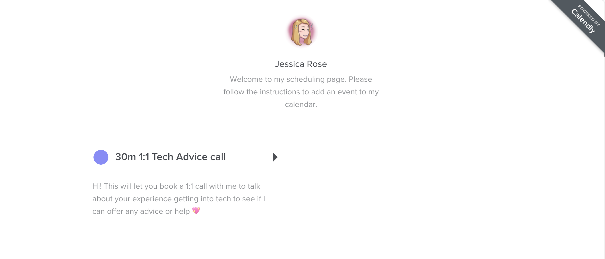
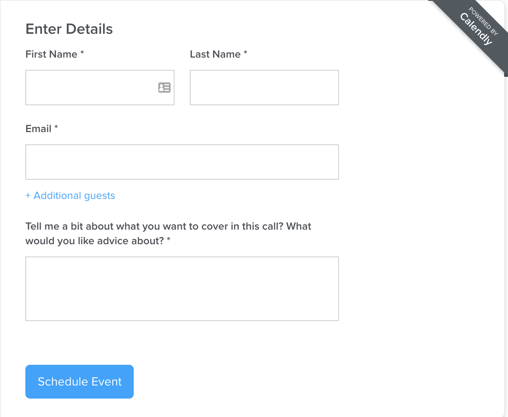

# Open-Advice-1-1s

I've been running open advice calls for technologists for the past several years, to help offer support to folks wanting advice about working in tech. I'm open sourcing my process and tooling here, in hopes that it will prove useful for anyone hoping to offer advice to people outside their immediate networks. While I've developed this process to use with people seeking advice about working in technology, this could be repurposed to fit the needs of advice seekers from any discipline.

The tools I've chosen work well for my workflow, but may not be a great fit for everyone. Feel free to substitute out for your favorite tools with similar functionality.

## Contribute to this guide
I'm excited to improve this process and welcome PRs, especially for folks using this with non-technology audiences. I would love to fill this repo with other approaches to offering open 1:1 advice calls and work to improve this guide.

# Process overview
1. Sign up for Calendly and Zoom accounts
2. Set up your Calendly event type and connect Zoom to your Calendly event type
3. Advertise your availability for 1:1's
4. Share your Calendly link with interested advice seekers
5. Join advice seekers via Zoom at agreed-upon time to chat
6. Offer empathetic support and advice
7. Take notes or plan follow up as needed

# Tooling
* [Calendly](https://calendly.com/): an automatic calendar booking system, to make it easy for advice seekers to book a slot in your calendar. Free for one meeting type, $8/month for full use. 14 day free trial available without needing a credit card.

* [Zoom](https://zoom.us/): A popular web conferencing software that can be connected to Calendly, giving each advice seeker a link for your call with them. Free for limited personal useage.

## Optional tooling

* [Zapier](https://zapier.com/): A service that will let you connect your Calendly account to Google Sheets, useful if you want to keep a record of who you have spoken to for followup.

# Setting up Calendly

Calendly is a great tool for managing signups for your open advice 1:1s with people. You'll want to have it fully set up before advertising your availability, so that you're able to share your Calendly link when requested.

You will need to create an event type you want to have advice-seekers book. Name this event type something that clearly communicates the purpose of the call. For example, the calendly event type for my 1:1 calls is called "30m 1:1 Advice call". Set up your event to only run on the times and dates you want to offer advice on.

You will need to set when you are available for 1:1 calls as part of setting up your Calendly event. You can set your availbility for set time intervals (Ex. 4pm to 6pm your local time) for either repeating dates (Ex. every Tuesday) or single set days (Ex. Tuesday August 5th)

To avoid conflicts with your schedule, you can connect Calendly with your calendar. Calendly will then only offer slots that are free on your calendar to advice-seekers.

Once you've set up your event type, check to see that it's displaying the information you intended. Here's an example of what an advice-seeker would see after clicking my Calendly link.

As part of your Calendly event, you can set questions that you want advice-seekers to fill out. I strongly recommend adding a question asking advice-seekers what they want your advice on, so you can prepare for your call with them.

Here is an example of the questions I ask advice-seekers to answer when booking an advice call with me.

To make your calls easier, I strongly recommend connecting your Calendly account to Zoom, which will generate links for calls for each advice-seeker. To join a call, both you and the advice-seeker can simply click the provided link at the designated time.

Calendly tips:
* Share your link via private or semi-private modes of communication like email, DMs or PMs.
  * Anyone who has your link can sign up, so sharing it directly on social media can lead to unexpected volume of signups
* Set a buffer period between calls, so that you have time to take notes or catch up with the details of your next call
* Make sure to only set yourself as available on days you're able to make calls

# Advertising your availability
Now that you have your event type set up in Calendly and Zoom connected, you can start booking calls with advice-seekers. You'll want to let people know that you're available for advice. This may be through an email, a newsletter, social media, word or mouth or any communication channel you like best.

I recommend specifically talking about the areas you’re able to advise on when you advertise your availability. Being explicit about what areas you can advise on will help reduce disappointment from advice-seekers who want help with areas outside your expertise.

I tend to use social media to advertise that I'm running open advice calls. I've included an example of a past Tweet below.

# Signing people up

As part of my own process, I have advice-seekers DM me to get my Calendly link. You may want to share this directly if you're communicating to potential advice-seekers via email or other relatively private communication channel.

Calendly will give people the option to pick the timeslot that suits them best and send you both calendar invites. It magically handles timezones, to make signups easier.

# Holding 1:1s

Now that you’ve got advice-seekers signed up, it’s time to get ready for your 1:1s. To give your best advice, you’ll need a quiet room that’s conducive to a private conversation, a stable internet connection and whatever audio setup you like best for calls.

If you’re doing several advice 1:1s in a row, I recommend having some water and coffee at your desk to minimize the need to get up. I also like to have a paper notebook and pens out, to take notes as calls progress.

# Giving advice

This is going to be the most challenging and most rewarding part of running open advice 1:1 calls. Advice is personal, and you'll need to find an approach that works well for you. 

Here are some very short guidelines for giving advice, based on my experiences. See it as my advice on advice!

* ✅ Recognize that your advice is coming from your perspective
* ✅ Ask open ended questions, often advice-seekers have a good idea of what they need to do next
* ✅ Let advice-seekers know there's no obligation to act on your advice
* ✅ Actively listen
* ✅ Ask what they've already tried
* ✅ Offer verbal support, sometimes people just need someone who is willing to listen
* 🚫 Don't insist that people act on your advice
* 🚫 Don't push for personal action for those impacted by structural problems (like discrimination)
* 🚫 Don't offer advice when you're not confident about your advice: it's ok to say you don't know
* 🚫 Never give advice that results in a financial or other benefit to yourself or your contacts
* 🚫 Don't bully, talk down to or yell at advice-seekers. You're there for them

